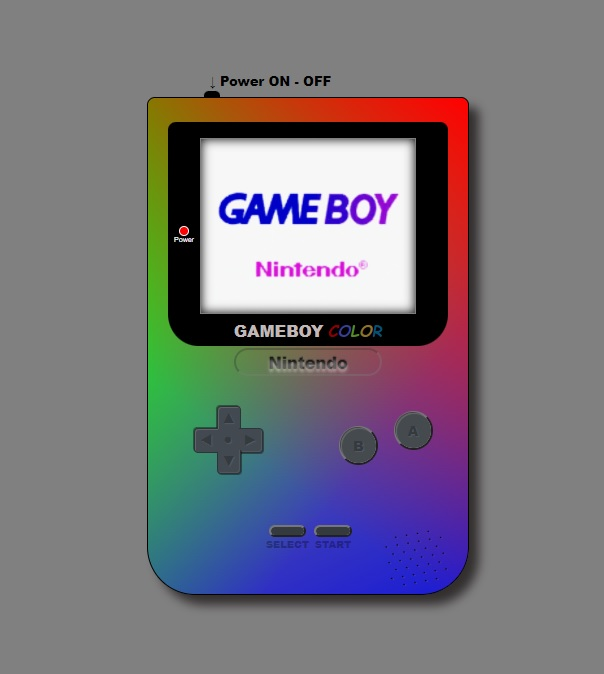

# ProyectoConsolaCss

Proyecto creado utilizando HTML, CSS y JS.

Puedes previsualizar el Proyecto haciendo click [aqui](https://andreumartinezg.github.io/ProyectoConsolaCss/)

## Indice:

<ol>
  <li>Introducción.</li>
  <li>Como usar.</li>
  <li>Descripción del Proyecto.</li>
  <li>Diseño.</li>
  <li>Funcionalidades.</li>
  <li>Futuras Funcionalidades.</li>
  <li>Herramientas Utilizadas.</li>
<ol>

  
## 1.Introducción.

En este proyecto he intentado simular con HTML, CSS y JS la consola GAMEBOY Color

